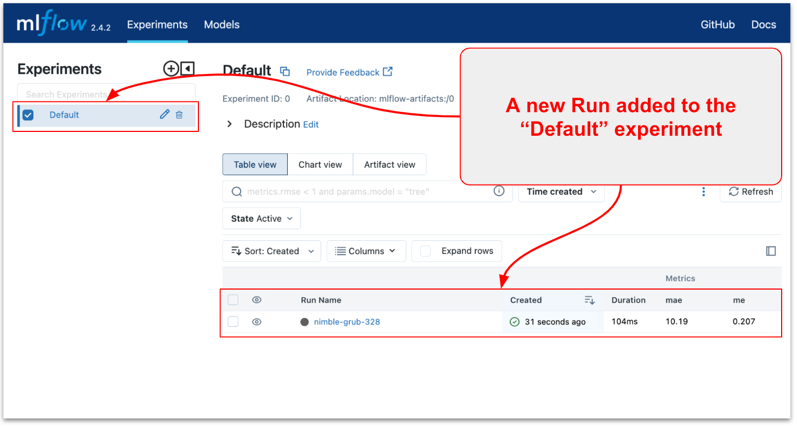

# Тьюториал: Основы MLFlow для Data Science

## **👀 Описание**

🎓 **Что это такое?** "Основы MLFlow для Data Science" - это не просто набор инструкций, это настоящий тьюториал, который погрузит вас в мир MLflow. Это практический гид, полный примеров и советов, чтобы вы могли легко использовать MLflow в ваших проектах по Data Science. 

👩🏻‍💻 **Для кого этот тьюториал?** Если вы Data Scientist или ML Engineer, то этот материал точно для вас. Неважно, новичок вы или уже с опытом, здесь найдется много полезного и интересного.

**🎯 Что вы узнаете?**

- Как отслеживать важные метрики ваших моделей с помощью MLFlow.
- Создавать, сравнивать и управлять ML экспериментами.
- Разбираться в метриках и артефактах запусков моделей.
- Эффективно использовать Model Registry для управления моделями.

🔍 **Как это устроено?** Вам не придется долго искать нужную информацию. Тьюториал содержит исчерпывающие примеры кода и пошаговые инструкции в формате Markdown.

⏱️ **Сколько времени нужно?** Всего 30 минут - и вы существенно расширите свои знания и навыки в MLflow.


## **👩‍💻 Installation**

First, install the pre-built example. Check the origin README file for more technical details and notes. 

**1. Fork / Clone this repository**

Clone the repository with the example code.

```bash
git clone https://gitlab.com/risomaschool/tutorials-raif/mlflow-1-metrics-tracking.git
cd mlflow-1-metrics-tracking
```

**2. Create a virtual environment**

This example requires Python 3.9 or above. 

```bash
python3 -m venv .venv
echo "export PYTHONPATH=$PWD" >> .venv/bin/activate
source .venv/bin/activate
pip install --upgrade pip setuptools wheel
pip install -r requirements-dev.txt
```

1.  **Download data**

This is a preparation step. Load data from [https://archive.ics.uci.edu/ml/datasets/bike+sharing+dataset](https://archive.ics.uci.edu/ml/datasets/bike+sharing+dataset) to the `data/` directory

```bash
python src/pipelines/load_data.py
```

4. **Launch MLflow UI**

To start the MLflow UI, run:

```bash
mlflow ui
```

And then navigate to [http://localhost:5000](http://localhost:5000) in your browser

5. **Run the Jupyter Lab or Jupyter Notebook**

```bash
jupyter lab
```

## ****🚀**** 1 - Трекинг метрик в MLFlow

<aside>
💡 Мы начнем знакомство с MLFlow в Jupyter Notebook `notebooks/1-get-started.ipynb`

</aside>

В этой части мы рассмотрим возможности отслеживания метрик с помощью MLflow. MLflow Tracking - это библиотека для отслеживания экспериментов и логирования метрик, которая устанавливается как Python пакет и легко интегрируется в код проекта. 

Возможности: 

- Log metrics, params, and artifacts to MLFlow.
- Log, register, and load models using a local MLflow Tracking Server.
- Interact with the MLflow Tracking Server using the MLflow fluent API.
- Perform inference on Pandas DataFrames by loading models as generic Python Functions (pyfunc).

### Шаг 1 - Обучим модель и посчитаем метрики

Запустите ячейки в разделе “Train model and calculate metrics”.  Мы не будем детально разбирать код этого разделе. Надеемся, что примеры кода достаточно просты. 

Пример описывает упрощенный процесс для типичного Data Science проекта. На выходе у нас есть несколько объектов, относящихся к эксперименту с моделью: 

- датасеты для обучения и тестирования модели
- модель
- гипер-параметры модели
- метрики качества модели

Для удобной работы с ML экспериментами нужен способ организации экспериментов и трекинга результатов. MLFlow как раз отличный вариант для этих задач!  Трекинг метрик и экспериментов в MLFlow позволяет систематизировать процесс разработки моделей машинного обучения, обеспечивая повторяемость, сравнение и анализ экспериментов.

### Шаг 2  - **Логирование параметров, метрик и артефактов**

**Настройка MLFlow**
Для начала работы с MLFlow, необходимо установить и настроить сервер трекинга. В простейшем случае это можно сделать, используя локальный сервер. Для этого, установите URI трекинга:

```python
MLFLOW_TRACKING_URI = "<http://localhost:5000>"
mlflow.set_tracking_uri(MLFLOW_TRACKING_URI)
```

**Логирование параметров, метрик и артефактов**:
Чтобы начать трекинг экспериментов, используйте контекстный менеджер `mlflow.start_run()`. В этом блоке можно логировать различные параметры и метрики:

```python
with mlflow.start_run() as run:
    # Логирование параметров модели
    mlflow.log_param('model', 'RandomForest')
    mlflow.log_params({'random_state': 0, 'n_estimators': 50})

    # Логирование метрик
    mlflow.log_metric('me', round(me, 3))
    mlflow.log_metric('mae', round(mae, 3))

    # Логирование артефактов, включая исходные данные и модель
    mlflow.log_artifact("../data/raw_data.csv")
    mlflow.log_artifact("../models/model.joblib")

    # Установка тегов для более удобного отслеживания экспериментов
    mlflow.set_tag("random-forest", "Random Forest Classifier")

    # Определение сигнатуры модели
    signature = infer_signature(X_train, model.predict(X_train))

    # Логирование самой модели
    model_info = mlflow.sklearn.log_model(
        sk_model=model,
        artifact_path="rf_model",
        signature=signature,
        input_example=X_train,
        registered_model_name="1-get-started-random-forest",
    )

```

Данный блок кода демонстрирует использование MLFlow для логирования различных аспектов эксперимента с машинным обучением. Давайте разберем его по частям:

1. **Начало эксперимента**:
    
    ```python
    with mlflow.start_run() as run:
    
    ```
    
    Эта строка инициирует новый эксперимент (или "запуск") в MLFlow. `with` гарантирует, что все, что находится внутри этого блока, будет относиться к текущему эксперименту. После завершения блока, эксперимент автоматически закрывается.
    
2. **Логирование параметров модели**:
    
    ```python
    mlflow.log_param('model', 'RandomForest')
    mlflow.log_params({'random_state': 0, 'n_estimators': 50})
    
    ```
    
    Здесь логируются параметры модели. `log_param` используется для записи отдельного параметра, а `log_params` - для записи нескольких параметров одновременно.
    
3. **Логирование метрик**:
    
    ```python
    mlflow.log_metric('me', round(me, 3))
    mlflow.log_metric('mae', round(mae, 3))
    
    ```
    
    Эти строки записывают метрики модели. В примере используются метрики `me` (средняя ошибка) и `mae` (средняя абсолютная ошибка), округленные до трех десятичных знаков.
    
4. **Логирование артефактов**:
    
    ```python
    mlflow.log_artifact("../data/raw_data.csv")
    mlflow.log_artifact("../models/model.joblib")
    
    ```
    
    Здесь логируются артефакты эксперимента, например, исходные данные (`raw_data.csv`) и файл модели (`model.joblib`).
    
    ⚠️Please, note that you need to pass the `model_path` to the `log_artifact` function, not the model object! The `log_artifact` function doesn’t know anything about the artifact you want to log.
    
5. **Установка тегов**:
    
    ```python
    mlflow.set_tag("random-forest", "Random Forest Classifier")
    ```
    
    Установка тегов помогает категоризировать и легко идентифицировать эксперименты в MLFlow.
    
6. **Определение сигнатуры модели**:
    
    ```python
    signature = infer_signature(X_train, model.predict(X_train))
    
    ```
    
    Сигнатура модели определяет формат входных и выходных данных. Это полезно для понимания того, какие данные модель ожидает на вход и что она выдаёт на выходе.
    
7. **Логирование самой модели**:
    
    ```python
    model_info = mlflow.sklearn.log_model(
        sk_model=model,
        artifact_path="rf_model",
        signature=signature,
        input_example=X_train,
        registered_model_name="1-get-started-random-forest",
    )
    
    ```
    
    Здесь логируется сама модель. Этот шаг сохраняет модель в MLFlow, включая её сигнатуру и пример входных данных. Это позволяет позже легко загрузить и использовать модель.
    

В целом, этот код представляет собой комплексный пример использования MLFlow для трекинга всех ключевых аспектов эксперимента с машинным обучением.

### Шаг 3  - MLflow UI

MLflow сохраняет все логированные данные в уникальную директорию для каждого запуска (run) и сохраняет их в базе данных. Веб-интерфейс MLflow позволяет просматривать список экспериментов, а также отдельные запуски с их параметрами и метриками. Метрики могут быть визуализированы в виде графиков, что упрощает анализ трендов и изменений в значениях метрик.

По умолчанию MLflow регистрирует все метрики и артефакты в эксперименте **`Default`**.



Перейдите к недавно созданному запуску и проверьте, что вы успешно залогировали метрики me и mae, а также файл model.joblib в разделе артефактов.


### Шаг 4  - Использование сохраненной модели для генерации прогнозов

<aside>
💡 Эта часть примера может не подойти для использования в `production` процессах. Однако, это может быть полезно для быстрого тестирования и анализа модели.

</aside>

После того, как модель обучена и залогирована в MLFlow, следующий шаг - её загрузка и использование для получения прогнозов. В этом разделе мы рассмотрим, как загрузить сохраненную модель в виде универсальной Python-функции и использовать её для предсказания на новых данных.

**Загрузка модели как Python-функции**:
Вместо того, чтобы загружать модель обратно в нативном формате scikit-learn с помощью `mlflow.sklearn.load_model()`, мы загружаем модель как универсальную Python-функцию. Это подход, который обычно используется для онлайн-размещения моделей, но он также подходит и для пакетных случаев использования.

```python
loaded_model = mlflow.pyfunc.load_model(model_info.model_uri)

```

Здесь `model_info.model_uri` содержит URI модели, сохраненной в MLFlow.

**Получение прогнозов для тестового набора данных**:
Теперь, когда модель загружена, её можно использовать для получения прогнозов на тестовом наборе данных `X_test`.

```python
predictions = loaded_model.predict(X_test)

```

**Подготовка Результатов для Анализа**:
Для анализа результатов предсказаний удобно использовать DataFrame Pandas.

- **Преобразование данных для валидации в DataFrame**:
    
    ```python
    result = pd.DataFrame(X_test)  # Здесь можно добавить имена колонок, если нужно
    ```
    
- **Добавление фактических классов в DataFrame**:
    
    ```python
    result["actual_class"] = y_test
    
    ```
    
- **Добавление предсказаний модели в DataFrame**:
    
    ```python
    result["predicted_class"] = predictions
    
    ```
    

Загрузка и использование модели для получения прогнозов - критически важный этап в рабочем процессе машинного обучения. Используя MLFlow, мы можем эффективно управлять моделями и их развертыванием, что обеспечивает гибкость и масштабируемость процесса разработки и применения моделей машинного обучения.

## 🚀 2 - Управление экспериментами (Experiments) и запусками (Runs)

<aside>
💡 В этом разделе вы будете работать с Jupyter Notebook `notebooks/2-manage-runs.ipynb`

</aside>

### Шаг 1 - Подготовка данных

Мы используем тот же датасет, что и в предыдущем примере. Запустите ячейки раздела `2. Prepdate Data`

### Step 2 - Настройка MLflow Client

Настройте клиент MLflow и задайте имя эксперимента. Это создаст или установит новый эксперимент MLflow под названием "1-Train-K-Fold". Позднее в MLflow Runs будут записываться метрики и артефакты, относящиеся к этому эксперименту. 

```python
# Set up MLFlow Client
MLFLOW_TRACKING_URI = "http://localhost:5000"
mlflow.set_tracking_uri(MLFLOW_TRACKING_URI)

client = MlflowClient()
print(f"Client tracking uri: {client.tracking_uri}")

# Set experiment name
mlflow.set_aexperiment('1-Train-K-Fold')
```


### Шаг 4 - Трекинг метрик для K-Fold Cross Validation

Теперь вы можете запустить обучение модели с K-Fold кроссвалидацией и логировать метрики в эксперимент `1-Train-K-Fold`.  Давайте реализауем такой сценарий для каждой итерации (Fold):

- Определить обучающий и тестовый наборы данных.
- Обучить модель, используя обучающий набор данных.
- Сделать прогнозы с помощью обученной модели.
- Посчитать метрики качества модели.
- Залогировать в MLFlow обученную модель, метрики и артефакты.

Учитывая, что наш набор данных имеет временное измерение, мы будем следовать рекомендациям для [Time Series Split](https://scikit-learn.org/stable/modules/cross_validation.html).


Давайте разберем код примера из раздела “**Log Metrics in multi-step training (K-Fold)”** 

```python
{...}
**for k, date in enumerate(experiment_batches):**
		
		# Define train data
    X_train = raw_data.loc[start_date_0:ref_end_data, numerical_features + categorical_features]
    y_train = raw_data.loc[start_date_0:ref_end_data, target] 

		# Define test data
		current = raw_data.loc[date[0]:date[1]]
    X_test = current.loc[:, numerical_features + categorical_features]
    y_test = current[target]
    
    # Train model {...}
		regressor = ensemble.RandomForestRegressor(random_state = 0, n_estimators = 50)
    regressor.fit(X_train, y_train)

		# Calculate metrics
    preds = regressor.predict(X_test)
    me = mean_squared_error(y_test, preds)
    mae = mean_absolute_error(y_test, preds)

		# Start a new MLflow Run
    with mlflow.start_run() as run: 
        
        # Log parameters
        mlflow.log_param("begin", date[0])
        mlflow.log_param("end", date[1])
        
        # Log metrics
        mlflow.log_metric('me', round(me, 3))
        mlflow.log_metric('mae', round(mae, 3))
        
        # Log model 
        mlflow.log_artifact(model_path)

    # Update reference end date
    ref_end_data = date[1]
```

Отличие этого примера от предыдущего в том, что здесь у нас есть цикл обучения модели по фолдам. Для каждого фолда расчитываются и логируются метрики.  

```bash

**for k, date in enumerate(experiment_batches):**
		...

		# Start a new MLflow Run
    with mlflow.start_run() as run: 
        
        # Log metrics
        mlflow.log_metric('me', round(me, 3))
        mlflow.log_metric('mae', round(mae, 3))
        ...
```

Важное отметить, что для каждого фолда создается новый запуск (Run) в MLflow, куда логируются параметры и метрики.  В результате вы получите список запусков в рамках эксперимента "1-Train-K-Fold". Каждый запуск в списке содержит метрики и параметры для каждого Fold. 


Вы можете настроить, какие столбцы отображать на дашборде. Просто зайдите в раздел «Columns» и выберете необходимые метрики и параметры.


### Шаг 5 -  Группировка запусков (Nested Runs)

В предыдущем примере каждый запуск эксперимента создавал несколько записей (Runs) в дашборде, что может быть не очень удобно. В конце концов, вам скорее будет интересны метрики на последнем фолде. Именно по метрикам на последнем фолде (и может быть средним по фолдам) вы будете сравнивать запуски экспериментов. 

На этом этапе вы внесете некоторые улучшения:

- Настроите группировку запусков (Nested Runs)
- Добавите дату окончания батча для именования фолдов
- Настроите логирование метрики и параметры для каждого фолда
- Настроите логирование модель только для последнего фолда

Чтобы сгруппировать запуски  в MLflow, используйте функцию "вложенных" запусков (Nested Runs). Приведенный ниже фрагмент кода демонстрирует структуру скрипта для реализации этого.

- Сначала инициируйте основной Run (или Parent). Parent Run - это одиночный запуск эксперимента со всеми фолдами.
- Внутри Parent Run инициируйте несколько вложенных (или Nested)  для каждого фолда. Для этого передайте аргумент `nested=True` в функцию `mlflow.start_run()`.
- Передайте аргумент `run_name` в функцию `mlflow.start_run()`, чтобы задать имя для Nested Run.

```python
# Начинаем новый Запуск (Родительский Запуск)
with mlflow.start_run() as run: 

    # Обучение модели для каждого пакета (K-Fold)
    for k, date in enumerate(experiment_batches):

        # Запускаем Дочерний Запуск для каждого Fold 
        with mlflow.start_run(run_name=date[1], nested=True) as child_run:
                        
            # Логирование в Дочерний Запуск (Fold)
            {...} 
        
    # Логирование в Родительский Запуск
		{...}
```

Давайте обсудим детали реализации.

Внутри Parent Run вы запускает обучение модели с K-Fold валидацией. Для каждого фолда создается отдельный дочерний Nested Run, в который вы логируете метрики.  

При этом, метрики для каждого фолда добавляются в объект metrics, чтобы их можно было впоследствии агрегировать. 

```python
# Обновление метрик с метриками для каждого Fold
metrics = {}

# Обучение модели для каждого пакета (K-Fold)
for k, date in enumerate(experiment_batches):

    # Код обучения модели, отчета о производительности и извлечения метрик...

    # Сохранение метрик для этого пакета в словарь
    metrics.update({date[1]: {'me': me, 'mae': mae}})
```

Наконец, после завершения кроссвалидации, переходите в контекст Parent Run, в котором 

- сохраняете модель и логируете ее как артефакт Parent Run
- вычисляете средние метрики по всем фолдам и логируете их в Parent Run

```python
# Начинаем новый Запуск (Родительский Запуск)
with mlflow.start_run() as run: 
    
    # Сохранение метрик каждого фолда в один объект
    metrics = {}

    # Обучение модели для каждого пакета (K-Fold)
    for k, date in enumerate(experiment_batches):
        
        # Обучение модели {...}
        # Извлечение метрик из отчета {...}
        
        # Запускаем Дочерний Запуск для каждого Fold 
        with mlflow.start_run(run_name=date[1], nested=True) as child_run:
            
            # Логирование метрик
            mlflow.log_metric('me', round(me, 3))
            mlflow.log_metric('mae', round(mae, 3))
            
            # Логирование отчета о производительности регрессии как артефакта
            mlflow.log_artifact(model_quality_report_path)
        
    # Сохранение окончательной модели
    joblib.dump(regressor, model_path)
    
    # Логирование модели последнего пакета как Родительского Запуска
    mlflow.log_artifact(model_path)
    
    # Логирование усредненных метрик в Родительском Запуске
    average_run_merics = pd.DataFrame.from_dict(metrics).T.mean().round(3).to_dict()
    mlflow.log_metrics(average_run_merics )
```

Давайте посмотрим, как результаты отображаются в MLFlow


⚠️ Обратите внимание, что:

- Parent Run отображает усредненные метрики (агрегированные по всем фолдам)
- обученная модель сохраняется в Parent Run
- в качестве имени Nested Run (фолд) используется дата окончания фолда

Таким образом, вы можете использовать MLFlow для организации обучения моделей с кроссвалидацией и логически разделить метаданные эксперимента между родительским и вложенными Run. Это дает вам возможность углубиться в детали каждого фолда, сохраняя при этом общий обзор эксперимента. 

Этот подход может быть также использован при обучении других моделей с большим количеством итераций и эпох. 

### Шаг 6 - Логирование Метрик со steps или timestamps

Логирование метрик по шагам или временным меткам в MLFlow позволяет более точно отслеживать изменения в производительности модели на протяжении времени обучения. 

В отличие от предыдущего шага, этот подход не создает отдельных Nested Run для каждого фолда. 

**Объяснение Примера Кода**

1. **Настройка Клиента MLFlow**:
    
    ```python
    MLFLOW_TRACKING_URI = "<http://localhost:5000>"
    mlflow.set_tracking_uri(MLFLOW_TRACKING_URI)
    client = MlflowClient()
    print(f"Client tracking uri: {client.tracking_uri}")
    
    ```
    
    Здесь настраивается подключение к серверу MLFlow, и создается клиент для взаимодействия с сервером.
    
2. **Установка Имени Эксперимента**:
    
    ```python
    mlflow.set_experiment('3-Metrics-by-steps')
    
    ```
    
    Имя эксперимента задается для группировки всех запусков в рамках одного проекта.
    
3. **Инициация Нового Запуска в MLflow**:
    
    ```python
    with mlflow.start_run() as run:
    
    ```
    
    Начало нового эксперимента (или "запуска") в MLFlow.
    
4. **Обучение Модели для Каждого Пакета (K-Fold)**:
В цикле проходим по каждому временному интервалу (пакету) и обучаем модель.
    - **Вычисление временной метки**:
        
        ```python
        timestamp = time.mktime(datetime.datetime.strptime(date[1], "%Y-%m-%d %H:%M:%S").timetuple())
        
        ```
        
        Здесь вычисляется временная метка для текущего пакета.
        
    - **Обучение модели и расчет метрик**:
        
        ```python
        regressor.fit(X_train, y_train)
        preds = regressor.predict(X_test)
        me = mean_squared_error(y_test, preds)
        mae = mean_absolute_error(y_test, preds)
        
        ```
        
        Процесс обучения модели и расчет метрик производительности.
        
5. **Логирование Метрик с Использованием Клиента**:
    
    ```python
    client.log_metric(run.info.run_id, 'me', round(me, 3), timestamp=int(timestamp)*1000)
    client.log_metric(run.info.run_id, 'mae', round(mae, 3), step=k)
    
    ```
    
    Логирование метрик с указанием временной метки (`timestamp`) и шага (`step`). Это позволяет отслеживать изменения метрик в зависимости от времени или итерации обучения.
    
6. **Логирование Модели и Параметров**:
    
    ```python
    mlflow.log_artifact(model_path)
    mlflow.log_param("begin", date[0])
    mlflow.log_param("end", date[1])
    
    ```
    
    Завершение эксперимента путем логирования модели и параметров эксперимента.
    

**Заключение**

Логирование метрик по шагам или временным меткам является ключевым компонентом для детального анализа и отслеживания производительности модели в процессе обучения. Это особенно важно в случаях работы с временными данными или при использовании сложных методов валидации, таких как K-Fold Cross-Validation.

## 🚀 3 - Управление моделями c MLFlow Model Registry

<aside>
💡 В этом разделе мы будем работать с Jupyter Notebook `notebooks/3-model-registry.ipynb`

</aside>

Реестр моделей MLflow (MLflow Model Registry) - это централизованное хранилище моделей, набор API и пользовательский интерфейс для совместного управления полным жизненным циклом модели MLflow. Он обеспечивает управление версиями моделей, позволяет присваивать им псевдонимы, добавлять теги и аннотации, а также отслеживать происхождение модели (из какого эксперимента и запуска MLflow была создана модель).

**Основные Возможности Реестра Моделей MLflow**

1. **Централизованное Хранилище Моделей**:
Реестр предоставляет единое место для хранения всех моделей вашего проекта, облегчая доступ и совместное использование моделей в команде.
2. **Управление Версиями Моделей**:
Реестр позволяет отслеживать разные версии модели, что помогает в управлении экспериментами и развертывании моделей.
3. **Добавление Тегов и Аннотаций**:
Теги и аннотации обеспечивают дополнительную информацию о модели, что может быть полезно для документирования и классификации моделей.

### **Регистрация Модели (UI)**

Следуйте приведенным ниже шагам, чтобы зарегистрировать вашу модель MLflow в Реестре Моделей.

**Откройте страницу запуска эксперимента (Run) в MLflow**
Перейдите к странице деталей того MLflow Run, который содержит залогированную модель MLflow, которую вы хотите зарегистрировать. Выберите папку модели, содержащую предполагаемую модель MLflow, в разделе "Artifacts".


Нажмите кнопку "Register Model”, после чего появится форма.

В выпадающем меню "Model” на форме вы можете либо выбрать "Создать новую модель" (Create New Model), что приведет к созданию новой зарегистрированной модели с вашей моделью MLflow в качестве её начальной версии, либо выбрать уже существующую зарегистрированную модель, в рамках которой ваша модель будет зарегистрирована как новая версия. На скриншоте ниже показан процесс регистрации модели MLflow в новой зарегистрированной модели под названием "iris_model_testing".


### **Найти зарегистрированные модели (UI)**

После регистрации ваших моделей в Реестре Моделей, вы можете найти их следующими способами.

- **Перейдите на страницу Зарегистрированных Моделей**:
Эта страница содержит ссылки на ваши зарегистрированные модели и соответствующие версии моделей.


- **Перейдите в Раздел Артефактов на странице вашего MLflow Run**:
Кликните на папку модели, а затем кликните на версию модели в верхнем правом углу, чтобы просмотреть версию, созданную из этой модели.


### Работа с Реестром Моделей MLflow Через API

Альтернативный способ взаимодействия с Реестром Моделей - использование интерфейса MLflow `model flavor` или API отслеживания клиента MLflow. В частности, вы можете зарегистрировать модель во время выполнения эксперимента MLflow или после всех ваших экспериментальных запусков.

**Регистрация Модели**

Ипользуйте параметр `registered_model_name` для автоматической регистрации модели.

- Если зарегистрированной модели с таким именем не существует, метод регистрирует новую модель и создает Версию 1.
- Если зарегистрированная модель с таким именем уже существует, метод создает новую версию модели.

**Инструкция**:
Запустите следующую ячейку кода **3 раза**, чтобы зарегистрировать 3 версии модели "bike-sharing-RandomForestRegressor".

```python
from mlflow.models import infer_signature

with mlflow.start_run() as run:
    # Вывод информации о созданном запуске
    print("ID эксперимента: {}".format(run.info.experiment_id))
    print("ID запуска: {}".format(run.info.run_id))
    print("Имя запуска: {}".format(run.info.run_name))
    print('MLFlow tracking uri:', mlflow.get_tracking_uri())
    print('MLFlow artifact uri:', mlflow.get_artifact_uri())
    run_id = run.info.run_id

    # Определение сигнатуры модели
    signature = infer_signature(y_test, preds_rf)

    # Логирование модели sklearn и регистрация как версия 1
    mlflow.sklearn.log_model(
        sk_model=model_rf,
        artifact_path="RandomForest",
        signature=signature,
        registered_model_name="RandomForest",
    )
```

**Найти зарегистрированные модели (API)**

Используйте `client.search_registered_models()` для поиска и отображения зарегистрированных моделей.

```python
from pprint import pprint

# Список и поиск моделей MLflow
for rm in client.search_registered_models():
    pprint(dict(rm), indent=4)
```

**Изменение стадии модели в (Dev → Production)**
Модель проходит через разные стадии жизненного цикла: от разработки до стадии тестирования и эксплуатации (Production).

```python
client.transition_model_version_stage(
    name="RandomForest", 
    version=3, 
    stage="Production"
)
```

**Загрузка и использование моделей из Model Registry**
Загрузите модель из реестра и используйте её для работы.

```python
model_uri = "models:/RandomForest/3"
loaded_model = mlflow.sklearn.load_model(model_uri)
loaded_model

```

**Отмена регистрации, удаление и архивирование Моделей**
Переводите версии моделей из производства в архив и удаляйте их при необходимости.

```python
client = MlflowClient()
client.transition_model_version_stage(
    name="RandomForest", version=2, stage="Archived"
)

# Удаление версии 1 модели
client.delete_model_version(
    name="RandomForest", version=1,
)

```

В этом разделе вы научились использовать API MLflow для работы с реестром моделей, включая регистрацию, поиск, изменение стадий, загрузку и использование, а также отмену регистрации, удаление и архивирование моделей. Эти функции помогают автоматизировать управление жизненным циклом моделей для целей MLOps. 

## **🔗 Дополнительные материалы**

- Getting Started with MLflow: [https://mlflow.org/docs/latest/getting-started/index.html](https://mlflow.org/docs/latest/getting-started/index.html)
- MLflow Model Registry: [https://mlflow.org/docs/latest/model-registry.html#ui-workflow](https://mlflow.org/docs/latest/model-registry.html#ui-workflow)