<!-- # Тьюториал: Основы MLFlow для Data Science -->

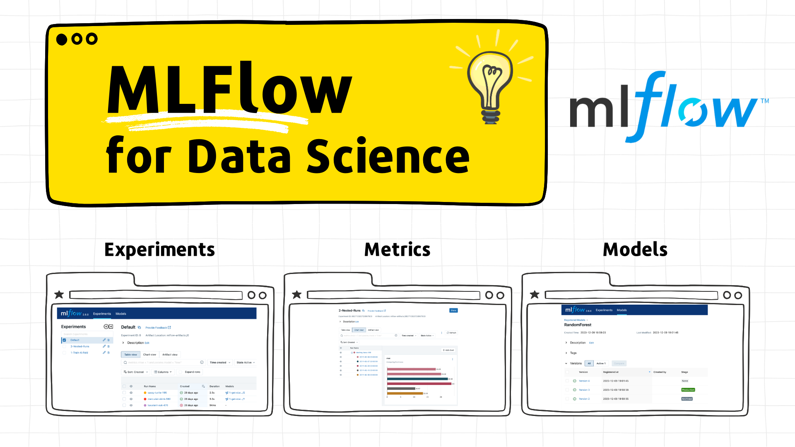

# Тьюториал: Основы MLFlow для Data Science
## 👀 Описание

🎓 **Что это такое?** "Основы MLFlow для Data Science" - это не просто набор инструкций, это настоящий тьюториал, который погрузит вас в мир MLflow. Это практический гид, полный примеров и советов, чтобы вы могли легко использовать MLflow в ваших проектах по Data Science. 

👩🏻‍💻 **Для кого этот тьюториал?** Если вы Data Scientist или ML Engineer, то этот материал точно для вас. Неважно, новичок вы или уже с опытом, здесь найдется много полезного и интересного.

**🎯 Что вы узнаете?**

- Как отслеживать важные метрики ваших моделей с помощью MLFlow.
- Создавать, сравнивать и управлять ML экспериментами.
- Разбираться в метриках и артефактах запусков моделей.
- Эффективно использовать Model Registry для управления моделями.

🔍 **Как это устроено?** Вам не придется долго искать нужную информацию. Тьюториал содержит исчерпывающие примеры кода и пошаговые инструкции в формате Markdown.

⏱️ **Сколько времени нужно?** Всего 30 минут - и вы существенно расширите свои знания и навыки в MLflow.

## 📖 Содержание
- [Тьюториал: Основы MLFlow для Data Science](#тьюториал-основы-mlflow-для-data-science)
  - [👀 Описание](#описание)
  - [📖 Содержание](#-содержание)
  - [👩‍💻 1 - Установка](#-1-установка)
  - [🚀 2 - Трекинг метрик в MLFlow](#-2-трекинг-метрик-в-mlflow)
    - [Шаг 1 - Обучим модель и посчитаем метрики](#шаг-1-обучим-модель-и-посчитаем-метрики)
    - [Шаг 2 - Логирование параметров, метрик и артефактов](#шаг-2-логирование-параметров-метрик-и-артефактов)
    - [Шаг 3  - MLflow UI](#шаг-3-mlflow-ui)
    - [Шаг 4  - Использование сохраненной модели для генерации прогнозов](#шаг-4-использование-сохраненной-модели-для-генерации-прогнозов)
  - [🧑🏻‍🔬 3 - Управление экспериментами (Experiments) и запусками (Runs)](#-3-управление-экспериментами-experiments-и-запусками-runs)
    - [Шаг 1 - Подготовка данных](#шаг-1-подготовка-данных)
    - [Шаг 2 - Созданеи экспериментов с MLflow Client](#шаг-2-созданеи-экспериментов-с-mlflow-client)
    - [Шаг 4 - Трекинг метрик для K-Fold Cross Validation](#шаг-4-трекинг-метрик-для-k-fold-cross-validation)
    - [Шаг 5 -  Группировка запусков (Nested Runs)](#шаг-5-группировка-запусков-nested-runs)
    - [Шаг 6 - Логирование Метрик со steps или timestamps](#шаг-6-логирование-метрик-со-steps-или-timestamps)
  - [🍱 4 - Управление моделями c MLFlow Model Registry](#4-управление-моделями-c-mlflow-model-registry)
    - [Как зарегистрировать модель?](#как-зарегистрировать-модель)
    - [Как найти зарегистрированную модель?](#как-найти-зарегистрированную-модель)
    - [Работа с Model Registry MLflow через API](#работа-с-model-registry-mlflow-через-api)
  - [🔗 Дополнительные материалы](#-дополнительные-материалы)

## 👩‍💻 1 - Установка

Сначала установите предварительно подготовленный пример, следуюя инструкциям в README исходного репозитория.

**1. Форкните / Склонируйте этот репозиторий**

```bash
git clone https://gitlab.com/risomaschool/tutorials-raif/mlflow-1-metrics-tracking.git
cd mlflow-1-metrics-tracking
```

**2. Создайте виртуальное окружение**

Этот пример требует Python версии 3.9 или выше.

```bash
python3 -m venv .venv
echo "export PYTHONPATH=$PWD" >> .venv/bin/activate
source .venv/bin/activate
pip install --upgrade pip setuptools wheel
pip install -r requirements-dev.txt
```

**3. Загрузите данные**

Загрузите данные с [https://archive.ics.uci.edu/ml/datasets/bike+sharing+dataset](https://archive.ics.uci.edu/ml/datasets/bike+sharing+dataset) в каталог `data/`.

```bash
python src/pipelines/load_data.py
```

**4. Запустите интерфейс MLflow**

Чтобы запустить MLflow UI, выполните в терминале команду:

```bash
mlflow ui
```

Затем перейдите по адресу [http://localhost:5000](http://localhost:5000) в браузере.

MLFlow UI позволяет просматривать список экспериментов, а также отдельные запуски с их параметрами и метриками. Метрики могут быть визуализированы в виде графиков, что упрощает анализ трендов и изменений в значениях метрик. 

В следующих разделах тьюториала вы создатите несколько экспериментов и запусков, чтобы увидеть, как это работает!

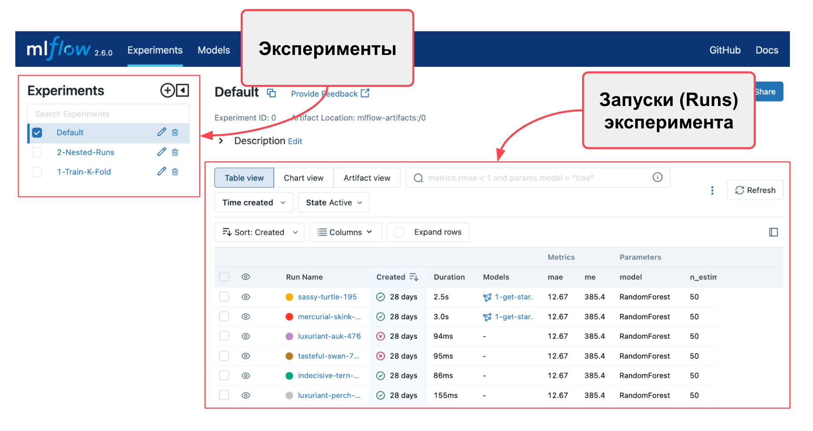{width=800}

## 🚀 2 - Трекинг метрик в MLFlow

> 💡 Мы начнем знакомство с MLFlow в Jupyter Notebook `notebooks/1-get-started.ipynb`
> Запустите Jupyter Lab или Jupyter Notebook и откройте этот файл.

В этой части мы рассмотрим возможности отслеживания метрик с помощью MLflow. MLflow - это библиотека для отслеживания экспериментов и логирования метрик, которая устанавливается как Python пакет и легко интегрируется в код проекта. 

Возможности:

- Логировать метрики, параметры и артефакты в MLFlow.
- Логировать, сохранять и загружать модели с использованием локального MLflow Tracking Server.
- Использовать MLflow API получения артефактов и результатов экспериментов.
- Запуск инференса с моделями, загруженными как обычные функции Python (pyfunc).

### Шаг 1 - Обучим модель и посчитаем метрики

> 💡 Запустите ячейки в разделе “Train model and calculate metrics”.  Мы не будем детально разбирать код этого разделе. Надеемся, что примеры кода достаточно просты. 

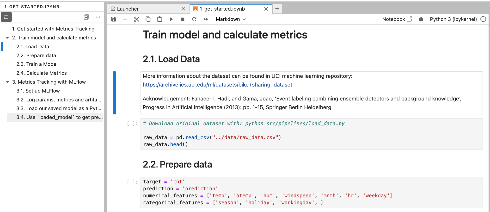{width=800}

Пример описывает упрощенный процесс для типичного Data Science проекта. На выходе у нас есть несколько объектов, относящихся к эксперименту с моделью: 

- датасеты для обучения и тестирования модели
- модель
- гипер-параметры модели
- метрики качества модели

Для удобной работы с ML экспериментами нужен способ организации экспериментов и трекинга результатов. MLFlow как раз отличный вариант для этих задач!  Трекинг метрик и экспериментов в MLFlow позволяет систематизировать процесс разработки моделей машинного обучения, обеспечивая повторяемость, сравнение и анализ экспериментов.

### Шаг 2 - Логирование параметров, метрик и артефактов

> 💡 Убедитесь, что MLFlow запущен и доступен по адресу [http://localhost:5000](http://localhost:5000). 
> Если нет, вернитесь в раздел "Установка" и запустите MLFlow UI.

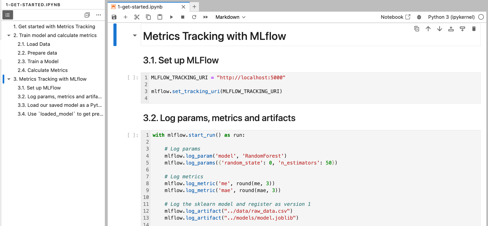{ width=600 }

**Настройка MLFlow**
Для начала работы с MLFlow, необходимо установить URI запущенного MLFlow Tracking Server, через который будут логировать метрики и параметры.  В этом примере мы будем использовать локальный сервер, доступный по адресу `http://localhost:5000`. 

```python
MLFLOW_TRACKING_URI = "http://localhost:5000"
mlflow.set_tracking_uri(MLFLOW_TRACKING_URI)
```

**Логирование параметров, метрик и артефактов**:
Чтобы начать трекинг экспериментов, используйте `mlflow.start_run()`, который создаст новый запуск MLflow Run, и будет записывать в него метрики и параметры.  В этом блоке можно логировать различные параметры и метрики:

```python
with mlflow.start_run() as run:
    # Логирование параметров модели
    mlflow.log_param('model', 'RandomForest')
    mlflow.log_params({'random_state': 0, 'n_estimators': 50})

    # Логирование метрик
    mlflow.log_metric('me', round(me, 3))
    mlflow.log_metric('mae', round(mae, 3))

    # Логирование артефактов, включая исходные данные и модель
    mlflow.log_artifact("../data/raw_data.csv")
    mlflow.log_artifact("../models/model.joblib")

    # Установка тегов для более удобного отслеживания экспериментов
    mlflow.set_tag("random-forest", "Random Forest Classifier")

    # Определение сигнатуры модели
    signature = infer_signature(X_train, model.predict(X_train))

    # Логирование самой модели
    model_info = mlflow.sklearn.log_model(
        sk_model=model,
        artifact_path="rf_model",
        signature=signature,
        input_example=X_train,
        registered_model_name="1-get-started-random-forest",
    )

```

Данный блок кода демонстрирует использование MLFlow для логирования результатов ML эксперимента. Давайте разберем его по частям:

1. **Начало эксперимента**:

    ```python
    with mlflow.start_run() as run:
        #...
    ```

    Эта строка инициирует новый запуск экспериментав MLFlow. with гарантирует, что все, что находится внутри этого блока, будет относиться к текущему Run. После завершения блока, контекст автоматически закрывается.

2. **Логирование параметров модели**:

    ```python
    mlflow.log_param('model', 'RandomForest')
    mlflow.log_params({'random_state': 0, 'n_estimators': 50})
    
    ```

    Здесь логируются параметры модели. `log_param()` используется для записи отдельного параметра, а `log_params()` - для записи нескольких параметров одновременно.

3. **Логирование метрик**:

    ```python
    mlflow.log_metric('me', round(me, 3))
    mlflow.log_metric('mae', round(mae, 3))
    
    ```

    Эти строки логируют метрики модели. В примере используются метрики `me` (средняя ошибка) и `mae` (средняя абсолютная ошибка), округленные до трех десятичных знаков.

4. **Логирование артефактов**:

    ```python
    mlflow.log_artifact("../data/raw_data.csv")
    mlflow.log_artifact("../models/model.joblib")
    ```

    Для логриования файлов (артефактов) эксперимента, в метод `log_artifact` передается путь к сохраненному файлу. Например, можно залогировать исходные данные (`raw_data.csv`) и файл модели (`model.joblib`).

    > ⚠️ Обратите внимание, что при логировании модели в `log_artifact()` нужно передавать путь к файлу, а не сам объект модели! Для лонирования моделей удобнее использовать `log_model()` (см. ниже) 

5. **Установка тегов**:

    ```python
    mlflow.set_tag("random-forest", "Random Forest Classifier")
    ```

    Установка тегов помогает категоризировать и легко идентифицировать эксперименты в MLFlow.

6. **Определение сигнатуры модели**:

    ```python
    signature = infer_signature(X_train, model.predict(X_train))    
    ```

    Сигнатура модели определяет формат входных и выходных данных. Это полезно для понимания того, какие данные модель ожидает на вход и что она выдаёт на выходе.

7. **Логирование самой модели**:

    ```python
    model_info = mlflow.sklearn.log_model(
        sk_model=model,
        artifact_path="rf_model",
        signature=signature,
        input_example=X_train,
        registered_model_name="1-get-started-random-forest",
    )
    ```

    Этот шаг сохраняет модель в MLFlow, включая её сигнатуру и пример входных данных. Это позволяет позже легко загрузить и использовать модель.

В целом, этот код представляет собой комплексный пример использования MLFlow для трекинга всех ключевых результатов ML эксперимента.

### Шаг 3  - MLflow UI

После запуска кода в предыдущем разделе, вы можете перейти в MLFlow UI и увидеть результаты эксперимента!

MLflow сохраняет все логированные данные в уникальную директорию для каждого запуска (run) и сохраняет их в базе данных. Веб-интерфейс MLflow позволяет просматривать список экспериментов, а также отдельные запуски с их параметрами и метриками. Метрики могут быть визуализированы в виде графиков, что упрощает анализ трендов и изменений в значениях метрик.

По умолчанию MLflow регистрирует все метрики и артефакты в эксперименте **`Default`**.

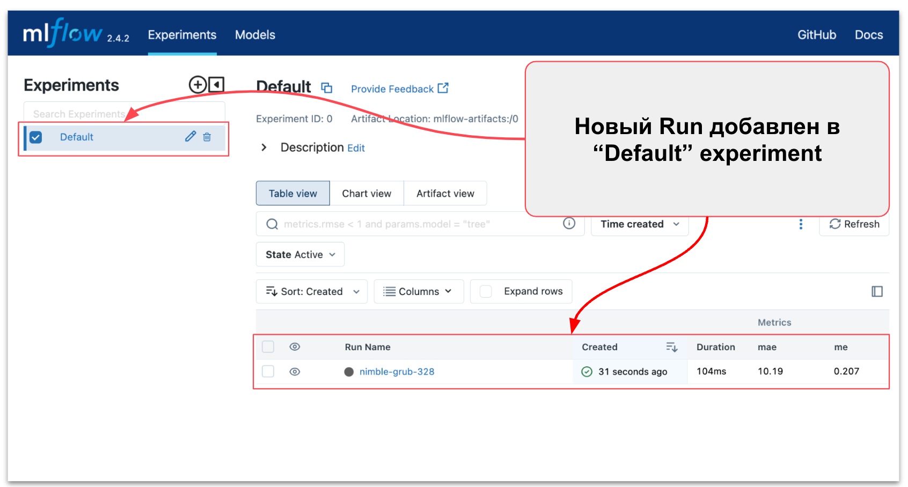{width=800}

Перейдите к недавно созданному запуску и проверьте, что вы успешно залогировали метрики me и mae, а также файл model.joblib в разделе артефактов.

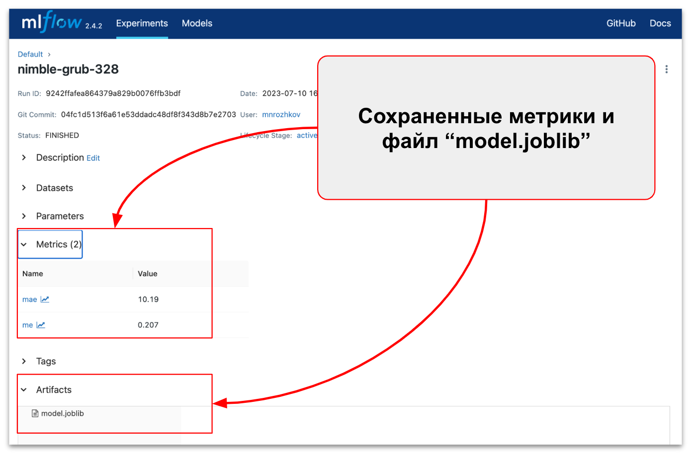{width=800}

### Шаг 4  - Использование сохраненной модели для генерации прогнозов

> 💡 Эта часть примера может не подойти для использования в `production` процессах. Однако, это может быть полезно для быстрого тестирования и анализа модели.

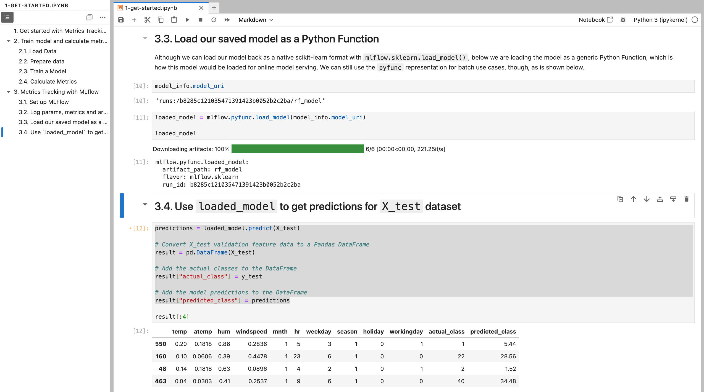{width=800}


После того, как модель обучена и залогирована в MLFlow, следующий шаг - её загрузка и использование для получения прогнозов. В этом разделе мы рассмотрим, как загрузить сохраненную модель в виде универсальной Python-функции и использовать её для предсказания на новых данных.

**Загрузка модели как Python-функции**:

Вместо того, чтобы загружать модель обратно в нативном формате scikit-learn с помощью `mlflow.sklearn.load_model()`, мы загружаем модель как универсальную Python-функцию. Этот подход можно использовать как для онлайн-сервинга моделей, так и для batch-скоринга.

```python
loaded_model = mlflow.pyfunc.load_model(model_info.model_uri)
```

Здесь `model_info.model_uri` содержит URI модели, сохраненной в MLFlow.

**Получение прогнозов для тестового набора данных**:

Теперь, когда модель загружена, её можно использовать для получения прогнозов на тестовом наборе данных `X_test`.

```python
# Get predictions
predictions = loaded_model.predict(X_test)

# Save results to Pandas DataFrame
result = pd.DataFrame(X_test)
result["actual_class"] = y_test
result["predicted_class"] = predictions
```

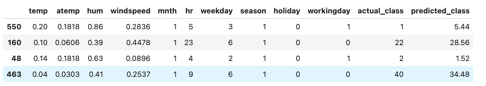{width=800}

Загрузка и использование модели для получения прогнозов - критически важный этап в рабочем процессе машинного обучения. Используя MLFlow, вы можете эффективно управлять моделями и их развертыванием.

## 🔬 3 - Управление экспериментами (Experiments) и запусками (Runs)

> 💡 В этом разделе вы будете работать с Jupyter Notebook `notebooks/2-manage-runs.ipynb`

В предыдущем разделе вы логировали результат эксперимента с помощью только `mlflow.start_run()`. В этом разделе вы научитесь использовать другой механизмов - [MLflow Client](https://mlflow.org/docs/latest/getting-started/logging-first-model/step2-mlflow-client.html). 

Модуль `mlflow.client` предоставляет Python интерфейс для CRUD  операций (создания, чтения, обновления и удаления) с MLflow Experiments, Runs, Model Versions и Registered Models. С помощью него вы cможете:

- Инициировать новый эксперимент (Experiment).
- Создавать новые запуски эксперимента (Run).
- Логировать параметры, метрики и метки (tags) запусков (Runs).
- Регистрировать артефакты, связанные с выполнениями, такие как модели, таблицы, графики и многое другое.

### Шаг 1 - Подготовка данных

Мы используем тот же датасет, что и в предыдущем примере. Запустите ячейки раздела `2. Prepdate Data`

### Шаг 2 - Созданеи экспериментов с MLflow Client

Настройте `MLFLOW_TRACKING_URI` и создайте MLflow Client. Созданный объект `client` можно использовать для создания новых экспериментов и запусков.

```python
# Set up MLFlow Client
MLFLOW_TRACKING_URI = "http://localhost:5000"
mlflow.set_tracking_uri(MLFLOW_TRACKING_URI)

client = MlflowClient()
print(f"Client tracking uri: {client.tracking_uri}")
```

Experiments в MLflow группируют отдельные запуски проекта. Чтобы созадать новый эксперимент `1-Train-K-Fold`, вы можете: 

- использовать `mlflow.set_experiment('1-Train-K-Fold')` (самый простой вариант)
- использовать MLflow Client (чтобы получить доступ к ID эксперимента и другим метаданным)

Разберем пример с MLflow Client.

```python

# Получить эксперимент по имени, если он существует
experiment_id = client.get_experiment_by_name('1-Train-K-Fold')

# Создать новый эксперимент, если он не существует
if not experiment_id:
    experiment_id = client.create_experiment('1-Train-K-Fold')

# Получить информацию о метаданных эксперимента
experiment = client.get_experiment(experiment_id)
print(f"Name: {experiment.name}")
print(f"Experiment_id: {experiment.experiment_id}")
print(f"Artifact Location: {experiment.artifact_location}")
print(f"Tags: {experiment.tags}")
print(f"Lifecycle_stage: {experiment.lifecycle_stage}")
```

В результате, в MLflow UI появится новый эксперимент `1-Train-K-Fold`.
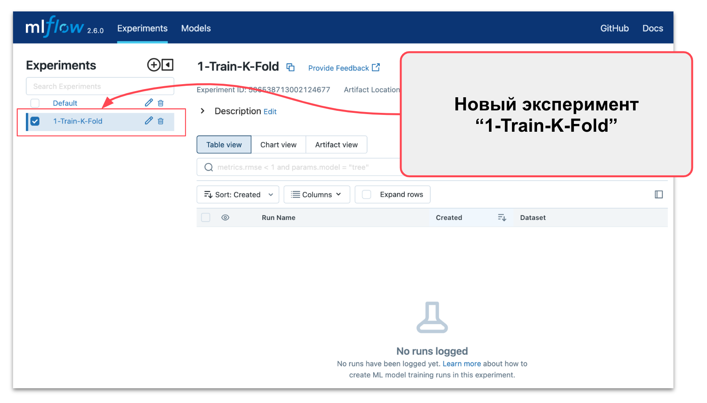{width=800}

### Шаг 4 - Трекинг метрик для K-Fold Cross Validation

> 💡 Перейдите в раздел `Metrics Tracking for K-Fold Experiments` в Jupyter Notebook `notebooks/2-manage-runs.ipynb`

Теперь давайте реализуем сценарий обучения модели с K-Fold кроссвалидацией и логировать метрики в эксперимент `1-Train-K-Fold`.  Для каждой итерации (Fold) необходмио:

- Определить обучающий и тестовый наборы данных.
- Обучить модель, используя обучающий набор данных.
- Сделать прогнозы с помощью обученной модели.
- Посчитать метрики качества модели.
- Залогировать в MLflow обученную модель, метрики и артефакты.

Учитывая, что наш набор данных имеет временное измерение, мы будем следовать рекомендациям для [Time Series Split](https://scikit-learn.org/stable/modules/cross_validation.html).

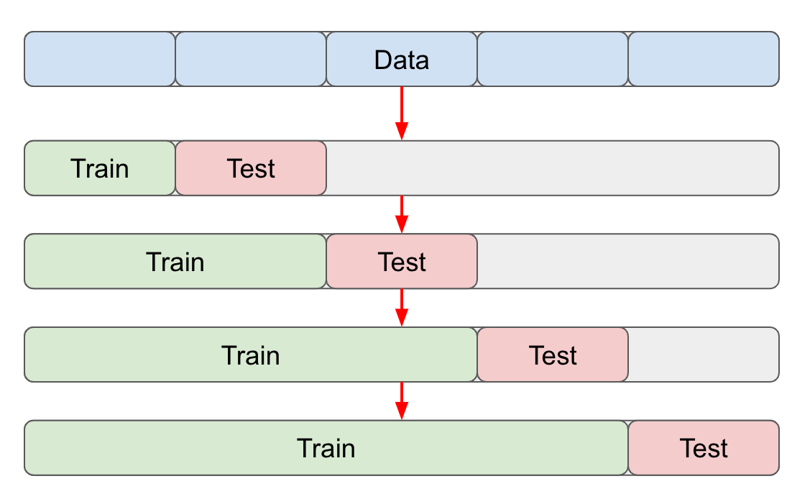{width=600}

Давайте разберем код примера из раздела **4. Metrics Tracking for K-Fold Experiments** 

```python

# Set experiment name
mlflow.set_experiment('1-Train-K-Fold')
...

for k, date in enumerate(experiment_batches):

    # Define train data
    X_train = raw_data.loc[start_date_0:ref_end_data, numerical_features + categorical_features]
    y_train = raw_data.loc[start_date_0:ref_end_data, target] 

    # Define test data
    current = raw_data.loc[date[0]:date[1]]
    X_test = current.loc[:, numerical_features + categorical_features]
    y_test = current[target]
    
    # Train model {...}
    regressor = ensemble.RandomForestRegressor(random_state = 0, n_estimators = 50)
    regressor.fit(X_train, y_train)

    # Calculate metrics
    preds = regressor.predict(X_test)
    me = mean_squared_error(y_test, preds)
    mae = mean_absolute_error(y_test, preds)

    # Start a new MLflow Run
    with mlflow.start_run() as run: 
        
        # Log parameters
        mlflow.log_param("begin", date[0])
        mlflow.log_param("end", date[1])
        
        # Log metrics
        mlflow.log_metric('me', round(me, 3))
        mlflow.log_metric('mae', round(mae, 3))
        
        # Log model 
        mlflow.log_artifact(model_path)

    # Update reference end date
    ref_end_data = date[1]
```

Отличие этого примера от предыдущего в том, что здесь у нас есть цикл обучения модели по фолдам. Для каждого фолда расчитываются и логируются метрики.  

```python

for k, date in enumerate(experiment_batches):
    ...

    # Start a new MLflow Run
    with mlflow.start_run() as run: 
        
        # Log metrics
        mlflow.log_metric('me', round(me, 3))
        mlflow.log_metric('mae', round(mae, 3))
        ...
```

Важное отметить, что для каждого фолда создается новый запуск (Run) в MLflow, куда логируются параметры и метрики.  В результате вы получите список запусков в рамках эксперимента "1-Train-K-Fold". Каждый запуск в списке содержит метрики и параметры для каждого Fold. 

{width=800}

Вы можете настроить, какие столбцы отображать на дашборде. Просто зайдите в раздел «Columns» и выберете необходимые метрики и параметры.

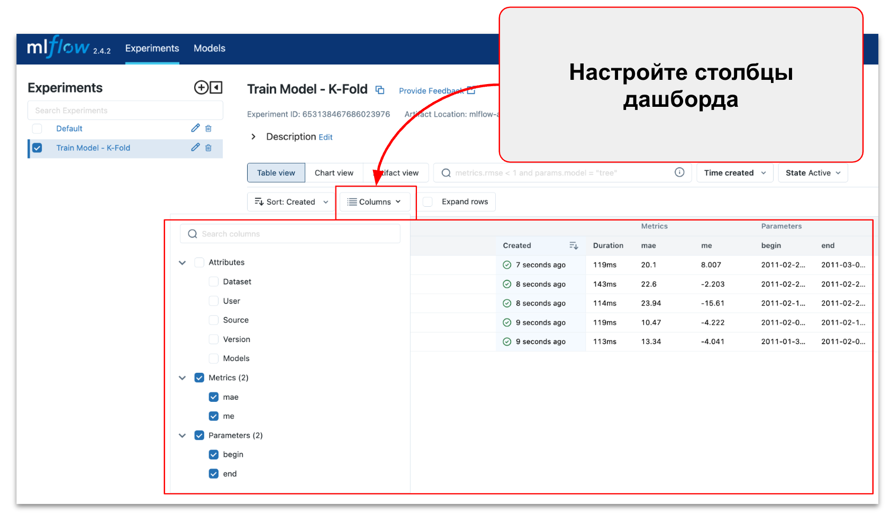{width=800}

### Шаг 5 -  Группировка запусков (Nested Runs)

> 💡 Перейдите в раздел `Nested Runs` в Jupyter Notebook `notebooks/2-manage-runs.ipynb`

В предыдущем примере каждый запуск эксперимента создавал несколько записей (Runs) в дашборде, что может быть не очень удобно. В конце концов, вам скорее будет интересны метрики на последнем фолде. Именно по метрикам на последнем фолде вы будете сравнивать запуски экспериментов.

На этом этапе вы внесете некоторые улучшения:

- Настроите группировку запусков (Nested Runs)
- Добавите дату окончания батча для именования фолдов
- Настроите логирование метрики и параметры для каждого фолда
- Настроите логирование модель только для последнего фолда

Чтобы сгруппировать запуски  в MLflow, используйте функцию "вложенных" запусков (Nested Runs). Приведенный ниже фрагмент кода демонстрирует структуру скрипта для реализации этого.

- Сначала инициируйте основной Run (назовем его Parent). Parent Run - это одиночный запуск эксперимента со всеми фолдами.
- Внутри Parent Run инициируйте несколько вложенных (или Nested)  для каждого фолда. Для этого передайте аргумент `nested=True` в функцию `mlflow.start_run()`.
- Передайте аргумент `run_name` в функцию `mlflow.start_run()`, чтобы задать имя для Nested Run.

```python
# Начинаем новый Запуск (Родительский Запуск)
with mlflow.start_run() as run: 

    # Обучение модели для каждого фолда
    for k, date in enumerate(experiment_batches):

        # Запускаем Дочерний Запуск для каждого фолда
        with mlflow.start_run(run_name=date[1], nested=True) as child_run:
                        
            # Логирование в Дочерний Запуск (Fold)
            ...
        
    # Логирование в Родительский Запуск
    ...
```

Давайте обсудим детали реализации. Внутри Parent Run вы запускает обучение модели с K-Fold валидацией. Для каждого фолда создается отдельный дочерний Nested Run, в который вы логируете метрики.  

При этом, метрики для каждого фолда добавляются в объект metrics, чтобы их можно было впоследствии агрегировать. 

```python
# Обновление метрик с метриками для каждого Fold
metrics = {}

# Обучение модели для каждого пакета (K-Fold)
for k, date in enumerate(experiment_batches):

    # Код обучения модели, отчета о производительности и извлечения метрик...

    # Сохранение метрик для этого пакета в словарь
    metrics.update({date[1]: {'me': me, 'mae': mae}})
```

Наконец, после завершения кроссвалидации, для Parent Run: 

- сохраните модель и логируйте ее как артефакт Parent Run
- вычислите агрегированные метрики по всем фолдам и логируете их в Parent Run

```python
# Начинаем новый Запуск (Родительский Запуск)
with mlflow.start_run() as run: 
    
    # Сохранение метрик каждого фолда в один объект
    metrics = {}

    # Обучение модели для каждого пакета (K-Fold)
    for k, date in enumerate(experiment_batches):
        
        # Обучение модели {...}
        # Извлечение метрик из отчета {...}
        
        # Запускаем Дочерний Запуск для каждого Fold 
        with mlflow.start_run(run_name=date[1], nested=True) as child_run:
            
            # Логирование метрик
            mlflow.log_metric('me', round(me, 3))
            mlflow.log_metric('mae', round(mae, 3))
            
            # Логирование отчета о производительности регрессии как артефакта
            mlflow.log_artifact(model_quality_report_path)
        
    # Сохранение окончательной модели
    joblib.dump(regressor, model_path)
    
    # Логирование модели последнего пакета как Родительского Запуска
    mlflow.log_artifact(model_path)
    
    # Логирование усредненных метрик в Родительском Запуске
    average_run_merics = pd.DataFrame.from_dict(metrics).T.mean().round(3).to_dict()
    mlflow.log_metrics(average_run_merics )
```

Давайте посмотрим, как результаты отображаются в MLFlow

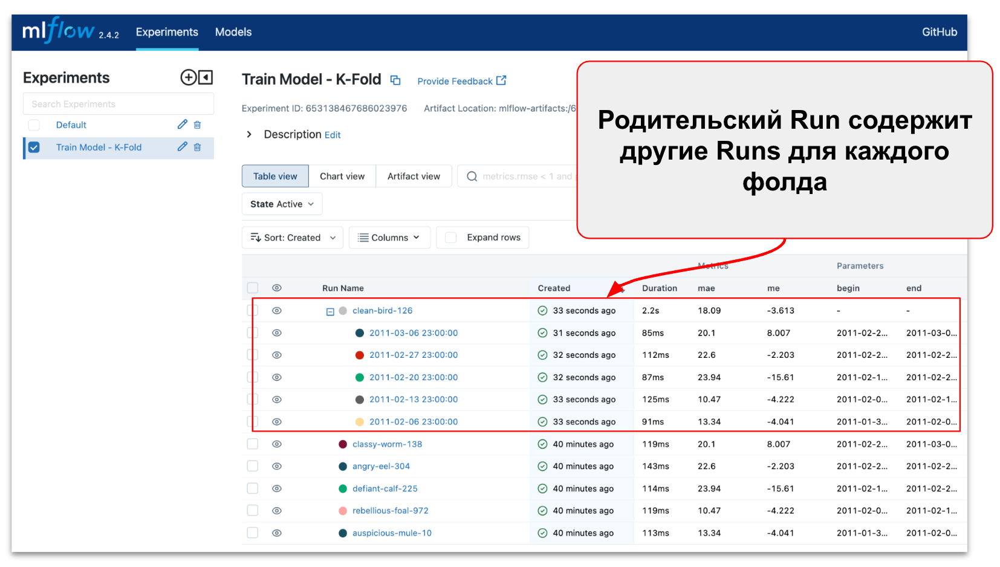{width=800}

> ⚠️ Обратите внимание, что:
>
>- в родительском Run отображаются усредненные метрики (агрегированные по всем фолдам)
>- обученная модель сохраняется в родительском Run
>- в качестве имени Nested Run (фолд) используется дата окончания фолда

Таким образом, вы можете использовать MLFlow для организации обучения моделей с кроссвалидацией и логически разделить метаданные эксперимента между родительским и вложенными Run. Это дает вам возможность углубиться в детали каждого фолда, сохраняя при этом общий обзор эксперимента. 

Этот подход может быть также использован при обучении других моделей с большим количеством итераций и эпох. 

### Шаг 6 - Логирование Метрик со steps или timestamps

> 💡 Перейдите в раздел `Log metrics by steps or timestamps` в Jupyter Notebook `notebooks/2-manage-runs.ipynb`

Логирование метрик по шагам или временным меткам в MLFlow позволяет более точно отслеживать изменения в производительности модели на протяжении времени обучения.

В отличие от предыдущего шага, этот подход не создает отдельных Nested Run для каждого фолда, а логирует метрики в рамках одного запуска (Run). 
```python
# Set up MLFlow Client
...

# Set experiment name
mlflow.set_experiment('3-Metrics-by-steps')

# Set experiment variables
model_path = Path('../models/model.joblib')
ref_end_data = end_date_0

# Start a new MLflow Run
with mlflow.start_run() as run: 

    # Run model train for each batch (K-Fold)
    for k, date in enumerate(experiment_batches):

        # Calculate timestamp
        timestamp = time.mktime(datetime.datetime.strptime(date[1], "%Y-%m-%d %H:%M:%S").timetuple())
        
        # Train model & calculate metrics
        ...
        
        # Log metrics (use Client)
        # >>> 'timestamp' - время, когда была рассчитана эта метрика (по умолчанию -текущее системное время)
        # >>> 'step' - целочисленный шаг обучения (итерация), на котором была рассчитана метрика (по умолчанию 0)
        client.log_metric(run.info.run_id, 'me', round(me, 3), timestamp=int(timestamp)*1000)
        client.log_metric(run.info.run_id, 'mae', round(mae, 3), step=k)

    # Log model 
    mlflow.log_artifact(model_path)

    # Log parameters
    mlflow.log_param("begin", date[0])
    mlflow.log_param("end", date[1])
```

При логировании метрик указывается дополнительный параметр `step` или `timestamp`, который позволяет отслеживать изменения метрик в зависимости от времени или итерации обучения. В результате, MLflow сохраняте метрики в виде временного ряда, который можно визуализировать в виде графика.

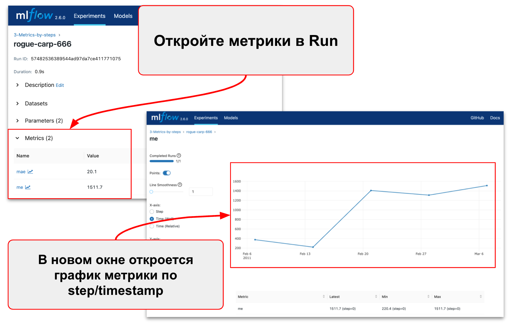{width=800}

Логирование метрик по шагам или временным меткам является ключевым компонентом для детального анализа и отслеживания производительности модели в процессе обучения. Это особенно важно в случаях работы с временными данными или при использовании сложных методов валидации, таких как K-Fold Cross-Validation.

## 🍱 4 - Управление моделями c MLFlow Model Registry

> 💡 В этом разделе мы будем работать с Jupyter Notebook `notebooks/3-model-registry.ipynb`

Реестр моделей MLflow (MLflow Model Registry) - это централизованное хранилище моделей, набор API и пользовательский интерфейс для совместного управления полным жизненным циклом модели MLflow. Он обеспечивает управление версиями моделей, позволяет присваивать им псевдонимы, добавлять теги и аннотации, а также отслеживать происхождение модели (из какого эксперимента и запуска MLflow была создана модель).

Основные возможности MLflow Model Registry:

1. Централизованное xранилище для хранения всех моделей вашего проекта.
2. Управление версиями моделей.
3. Добавление тегов и аннотаций, что может быть полезно для документирования и классификации моделей.

### Как зарегистрировать модель? 

Следуйте приведенным ниже шагам, чтобы зарегистрировать вашу модель MLflow в Реестре Моделей.

**Откройте страницу запуска эксперимента (Run) в MLflow**
Перейдите к странице деталей того MLflow Run, который содержит залогированную модель MLflow, которую вы хотите зарегистрировать. Выберите папку модели, содержащую предполагаемую модель MLflow, в разделе "Artifacts".

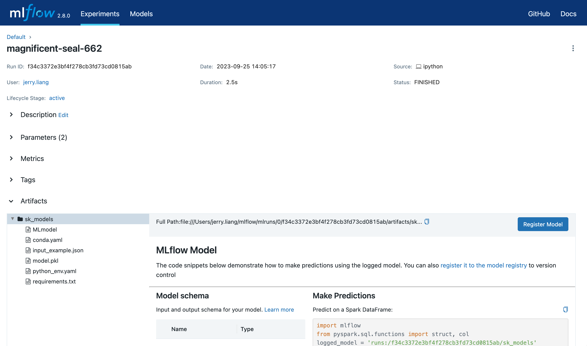{width=800}

Нажмите кнопку "Register Model”, после чего появится форма.

В выпадающем меню "Model” на форме вы можете либо выбрать "Создать новую модель" (Create New Model), что приведет к созданию новой зарегистрированной модели с вашей моделью MLflow в качестве её начальной версии, либо выбрать уже существующую зарегистрированную модель, в рамках которой ваша модель будет зарегистрирована как новая версия. На скриншоте ниже показан процесс регистрации модели MLflow в новой зарегистрированной модели под названием "iris_model_testing".

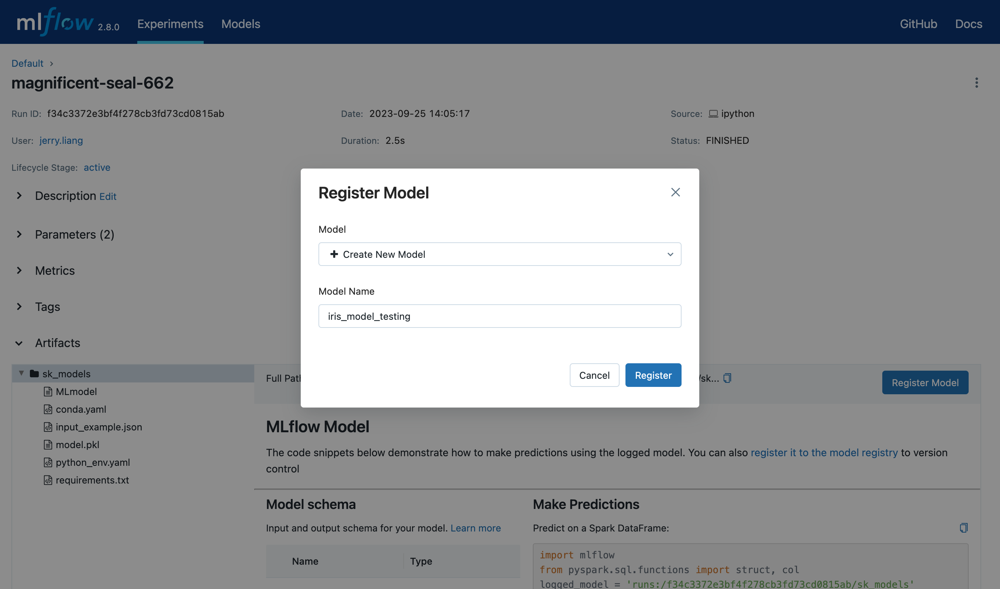{width=800}

### Как найти зарегистрированную модель?

После регистрации ваших моделей в Реестре Моделей, вы можете найти их следующими способами.

1. Перейдите на страницу Зарегистрированных Моделей
    Эта страница содержит ссылки на ваши зарегистрированные модели и соответствующие версии моделей.

    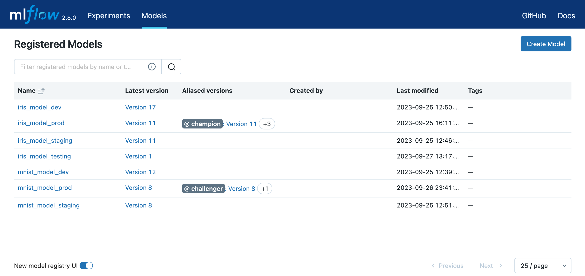{width=800}

2. Перейдите в Раздел Артефактов на странице вашего MLflow Run
    Кликните на папку модели, а затем кликните на версию модели в верхнем правом углу, чтобы просмотреть версию, созданную из этой модели.

    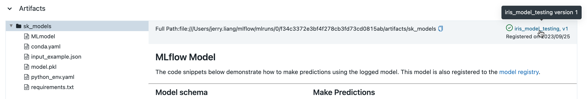{width=800}

### Работа с Model Registry MLflow через API

Альтернативный способ взаимодействия с Реестром Моделей - использование интерфейса MLflow `model flavor` или API отслеживания клиента MLflow. В частности, вы можете зарегистрировать модель во время выполнения эксперимента MLflow или после всех ваших экспериментальных запусков.

**Как зарегистрировать модель через API?**
Для автоматической регистрации модели укажите имя модели в реестре, в качестве параметра `registered_model_name` метода `log_model()`.

```python
mlflow.sklearn.log_model(
    sk_model=model_rf,
    registered_model_name="RandomForest",
)
```

- Если модели с таким именем в реестре нет, метод зарегистрирует новую модель и назначет `Version 1`.
- Если зарегистрированная модель с таким именем уже существует, метод создает новую версию модели.

Запустите следующую ячейку кода **3 раза**, чтобы зарегистрировать 3 версии модели "RandomForest".

```python
from mlflow.models import infer_signature

with mlflow.start_run() as run:

    # Определение сигнатуры модели
    signature = infer_signature(y_test, preds_rf)

    # Логирование модели sklearn и регистрация как версия 1
    mlflow.sklearn.log_model(
        sk_model=model_rf,
        artifact_path="RandomForest",
        signature=signature,
        registered_model_name="RandomForest",
    )
```

**Как найти зарегистрированные модели?**
Используйте `client.search_registered_models()` для поиска и отображения зарегистрированных моделей.

```python
from pprint import pprint

# Список и поиск моделей MLflow
for rm in client.search_registered_models():
    pprint(dict(rm), indent=4)
```

**Как измененить стадию модели на Production?**
Модель проходит через разные стадии жизненного цикла: от разработки до стадии тестирования и эксплуатации (Production). Для того, чтобы указать нужную стадию, используйте метод `transition_model_version_stage()`.

```python
client.transition_model_version_stage(
    name="RandomForest", 
    version=3, 
    stage="Production"
)
```

**Как загрузка и использовать модель из Model Registry?**
Для загрузки модели потребуется URI модели, и `flavor`. URI модели состоит из имени модели и версии. Flavor модели - это специфичный для фреймворка формат, в котором модель сохраняется в MLflow. Например, для моделей `scikit-learn` это формат pickle.

```python
model_uri = "models:/RandomForest/3"
loaded_model = mlflow.sklearn.load_model(model_uri)
loaded_model

```

**Как отменить регистрацию, удалить и архивировать модель?**
Вы можете отменить регистрацию, удалить и архивировать модель с помощью методов `delete_registered_model()`, `delete_model_version()` и `transition_model_version_stage()`.

Например, чтобы удалить версию 1 модели RandomForest, используйте:

```python
# Удаление версии 1 модели
client.delete_model_version(
    name="RandomForest", version=1,
)
```

Для архивации версию 2 модели RandomForest, используйте:

```python
client = MlflowClient()
client.transition_model_version_stage(
    name="RandomForest", version=2, stage="Archived"
)
```

В этом разделе вы научились использовать API MLflow для работы с реестром моделей, включая регистрацию, поиск, изменение стадий, загрузку и использование, а также отмену регистрации, удаление и архивирование моделей. 
Теперь вы моежте использовать автоматизировать большую часть процессов управления жизненным циклом моделей для MLOps.

## 🔗 Дополнительные материалы

- Getting Started with MLflow: [https://mlflow.org/docs/latest/getting-started/index.html](https://mlflow.org/docs/latest/getting-started/index.html)
- MLflow Model Registry: [https://mlflow.org/docs/latest/model-registry.html#ui-workflow](https://mlflow.org/docs/latest/model-registry.html#ui-workflow)

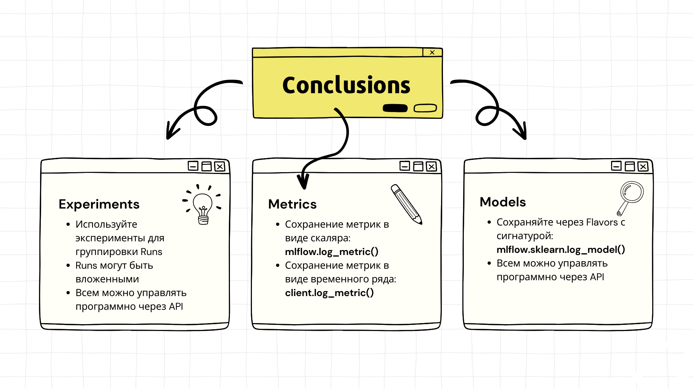

[⬆️ Содержание](#-содержание)